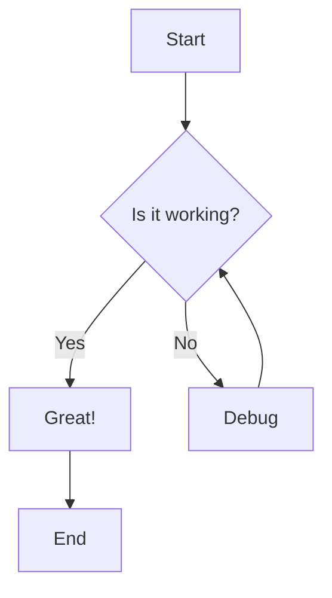

# Welcome to mdpreview

This is a sample markdown file to demonstrate the features of **mdpreview**.

## Features

- ✅ **GFM Support**: Tables, task lists, strikethrough
- 🎨 **Syntax Highlighting**: Code blocks with language detection
- 📊 **Mermaid Diagrams**: Flowcharts, sequence diagrams, and more
- 🌙 **Dark Mode**: Automatic theme switching
- 📑 **Table of Contents**: Auto-generated from headings

## Code Example

Here's a simple JavaScript function:

```javascript
function greet(name) {
  return `Hello, ${name}!`;
}

console.log(greet('World'));
```

## Tables

| Feature | Supported | Notes |
|---------|-----------|-------|
| GFM | ✅ | Full support |
| Mermaid | ✅ | Client-side rendering |
| Math | ❌ | Future feature |

## Task Lists

- [x] Set up project
- [x] Implement file tree
- [x] Add markdown preview
- [x] Support dark mode
- [ ] Add more features

## Mermaid Diagram



## Blockquote

> This is a blockquote.
> It can span multiple lines.

## Lists

### Unordered List

- Item 1
- Item 2
  - Nested item 2.1
  - Nested item 2.2
- Item 3

### Ordered List

1. First item
2. Second item
3. Third item

## Links and Images

- [GitHub](https://github.com)
- [mdpreview](https://github.com/kght6123/mdpreview)

## Inline Code

You can use `inline code` like this.

## Strikethrough

~~This text is strikethrough~~

---

**Enjoy using mdpreview!** 🎉
