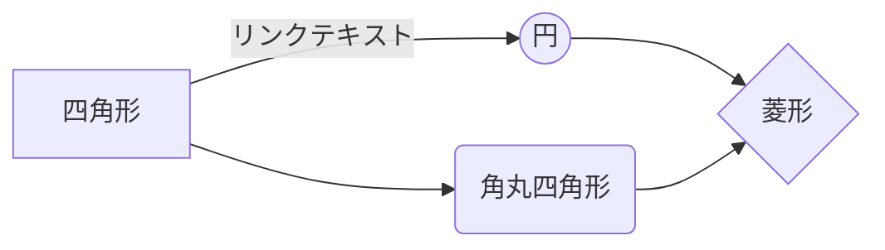
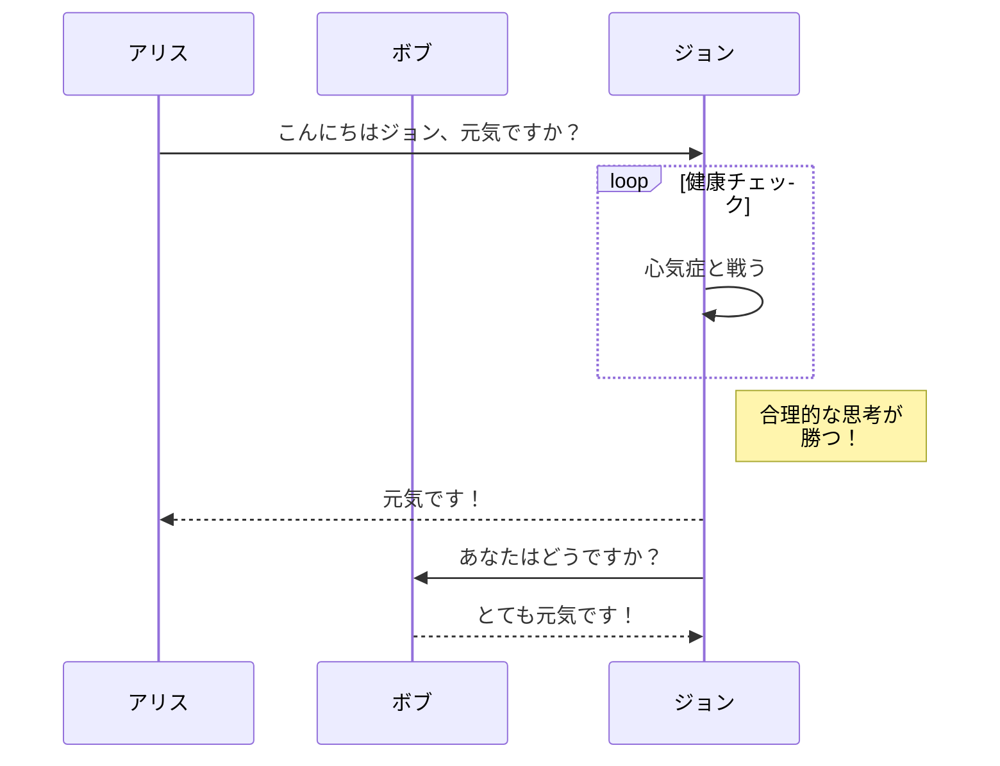
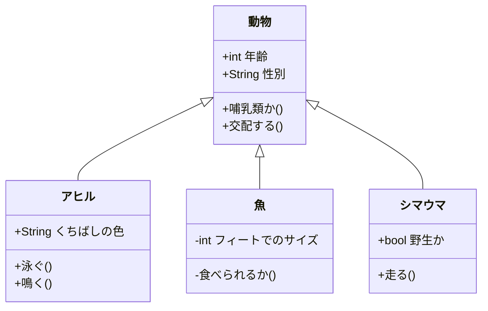
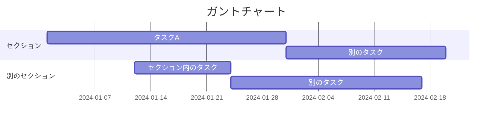

# Mermaid図表の例

このドキュメントでは、さまざまなMermaid図表タイプを紹介します。

## フローチャート

```mermaid
graph LR
    A[四角形] -- リンクテキスト --> B((円))
    A --> C(角丸四角形)
    B --> D{菱形}
    C --> D
```

## シーケンス図

```mermaid
sequenceDiagram
    participant アリス
    participant ボブ
    アリス->>ジョン: こんにちはジョン、元気ですか？
    loop 健康チェック
        ジョン->>ジョン: 心気症と戦う
    end
    Note right of ジョン: 合理的な思考が<br/>勝つ！
    ジョン-->>アリス: 元気です！
    ジョン->>ボブ: あなたはどうですか？
    ボブ-->>ジョン: とても元気です！
```

## クラス図

```mermaid
classDiagram
    動物 <|-- アヒル
    動物 <|-- 魚
    動物 <|-- シマウマ
    動物 : +int 年齢
    動物 : +String 性別
    動物: +哺乳類か()
    動物: +交配する()
    class アヒル{
        +String くちばしの色
        +泳ぐ()
        +鳴く()
    }
    class 魚{
        -int フィートでのサイズ
        -食べられるか()
    }
    class シマウマ{
        +bool 野生か
        +走る()
    }
```

## ガントチャート

```mermaid
gantt
    title ガントチャート
    dateFormat  YYYY-MM-DD
    section セクション
    タスクA           :a1, 2024-01-01, 30d
    別のタスク     :after a1  , 20d
    section 別のセクション
    セクション内のタスク      :2024-01-12  , 12d
    別のタスク      : 24d
```
